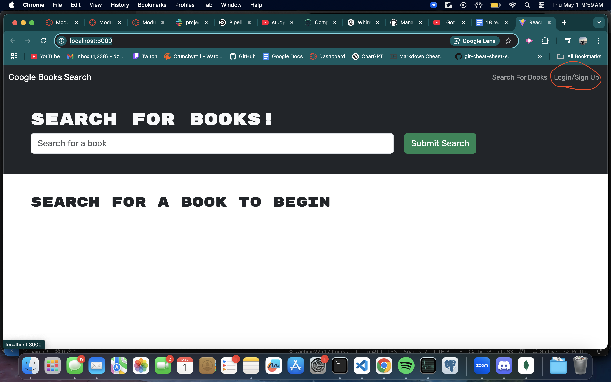
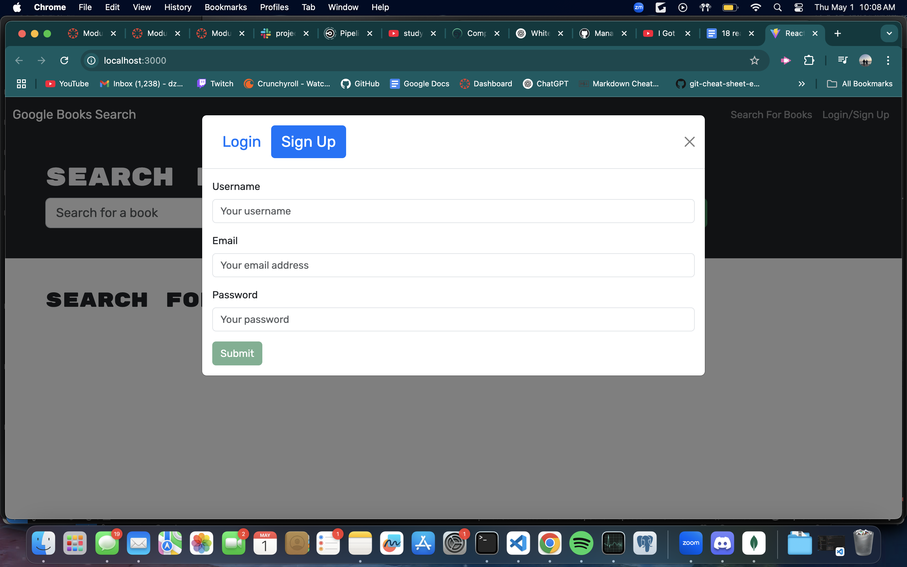

  # Book Search Engine
  
  
  
  ## About

  The book search engine is a full stack application that utilizes graphql’s api capabilities to allow users to search for any book and curate their own list of saved books.
   

   
  ## Table of Contents 
  - [Installation](#installation)
  - [Usage](#usage)
  - [Contributing](#contributing)
  - [Tests](#tests)
  - [License](#license)
  - [Questions](#questions)
   

   
  ## Installation
   
  Here are the prerequisites necessary to use the project:
   
  *Nothing but access to a browser and an internet connection!*
  
  To get started with the project, follow these steps:
   
  No installation is necessary for this application. Simply visit the deployed website [here](https://one8-books-graphql.onrender.com/)
   

   
  ## Usage 
   
  Here are the steps to start the application:
   
  N/A
  
  To use the application, do the following:

  When the website loads you will see a search bar and an option to log in/sign up on the top of the homescreen:

  
  
  Any site visiter is allowed to use the search function by typing the desired book title and pressing submit search. However, only users who are logged in will be able to save books. To create a free account, press on the log in/signup option as shown in the image above, then press sign up on the top of the modal. You will then be prompted to create a username, password, and enter an email.
  
  
    
  ## Contributing
   
  Any contributions are appreciated as they are vital to the improvement and wellbeing of the project.

  If you would like to contribute, please follow these steps:

  1. **Fork the repository** to your own github account
2. **Clone the forked repository** to your local machine
3. **Create a branch** for your changes
4. **Install dependencies**, type npm install in the terminal of the code editor to install all packages required for the application (Nodejs required)
5. **Make your changes**, while ensuring they follow the project’s standards
6. **Test your changes** to verify they work
7. **Commit your changes** with a descriptive commit message
8. **Push the changes** to your forked repository
9. **Submit a pull request** from your branch to the main repository with a detailed description of the changes and any potential issues.
10. **Be responsive to feedback** and make any updates necessary.

   

   
  ## Tests
   
  In order to run tests on the project, do the following:
   
  *Tests are not yet available for this project*
   

   
  ## License 
   
  This application is covered under the MIT License. For more information, view the official documentation [here](https://opensource.org/license/MIT).
   

   
  ## Questions
   
  For any questions or assistance, please reach out through these mediums:
   
  - **Github:** [zachmc27](https://github.com/zachmc27)
  - **Email:** <zmcgregor344@gmail.com>

  